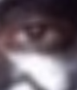
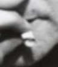
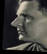
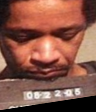
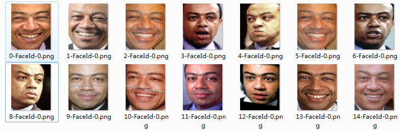
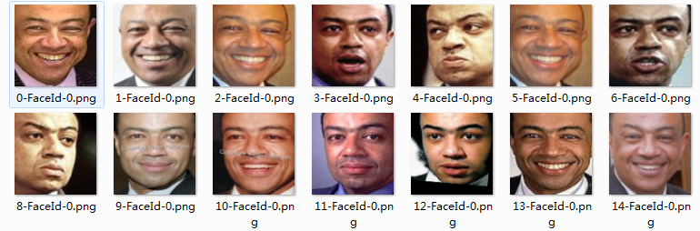

# About Face Alignment

we use MTCNN to align Face to the size of [96,112],MTCNN is a good Face detector but still there are something you should pay attention:

### low confidence

while MTCNN will return a confidence of the deteced face,make sure to use this face image while the confidence is pretty high,like larger than 0.9 or 0.95

there are two example of low confidence face aligment:

 

### landmark shift

landmark will be different while detect the same person,which will make confusion to CNN learning:

 

 

### occlusion

also bad for occlusion:

### alignment criterion
we use the alignment offered by @happynear and the repository is here:

[happynear/FaceVerification](https://github.com/happynear/FaceVerification)

at https://github.com/happynear/FaceVerification/dataset/CK/align_CK.py

# About noise

MS_Celeb_1M dataset is pretty dirty.A pre-cleaning list will be find here:

[Light CNN for Deep Face Recognition](https://github.com/AlfredXiangWu/LightCNN)

whilch use a pre-trained center_loss model to do cluster.

there are two types of noise:inter_class & intra_class

### intra-class

we have done the intra_class by ourselves,which contains two lists:

[outlier:images that do not belong to the label class](./clean_list/intra_class/outlier.txt)

[same:images that repeated in the same class](./clean_list/intra_class/same.txt)

### inter-class

we also do inter_class cleanning but at this stage we can't offer the cleansed list.

### map list
the map list of class_id(in the cleaned list) and corresponding person id(Ms_celeb_1M) is here:

[Baidu Drive](http://pan.baidu.com/s/1o7FFWyY)

# About training

### loss function & CNN construction

we use [A-softmax](https://github.com/wy1iu/sphereface) to train our model,with a 28-Layers ResFace CNN construction.

### trick to help converging

we also use FN(described in this paper:[DeepVisage: Making face recognition simple yet with powerful generalization skills](https://arxiv.org/abs/1703.08388)) method to help the trainning convergeing faster.If you want to train a 64 Layers CNN model,this method really helps a lot.

### prototxt

the deploy.txt at 'example' folder.You may need to add the classification layer and the softmax_loss layer by youself If you want to train model on your dataset.

We do not offer slover.prototxt & log.txt but you can know the parament in solver.txt

# Update at 2017/11/15

## something interesting

### new alignment method 

alignment by MTCNN:

alignment by Ours:

# Result

we reach 99.76% on LFW by our own dataset and 99.6% on MS-Celeb-1M

# Citation

If you find SphereFace or FN useful,please cite the link above in your paper.

# Contributor
@KaleidoZhouYN @TuringKi @Dickachu Yang